# TOTOLINK A3300R V17.0.0cu.557_B20221024 Command Injection

## Product Information

Product: TOTOLINK A3300R
Firmware Version: V17.0.0cu.557_B20221024
Manufacturer's website information：https://www.totolink.net/
Firmware download address ：https://www.totolink.net/home/menu/detail/menu_listtpl/download/id/241/ids/36.html

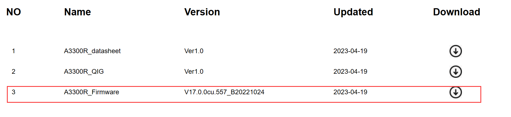

## Attack Type

remote

## Description

TOTOLINK A3300R V17.0.0cu.557_B20221024 is vulnerable to Incorrect Access Control. Attackers are able to reset serveral critical passwords without authentication by visiting specific pages.

### POC

Visit /wizard.html directly

## Analyse

The home page that shows original passwords.

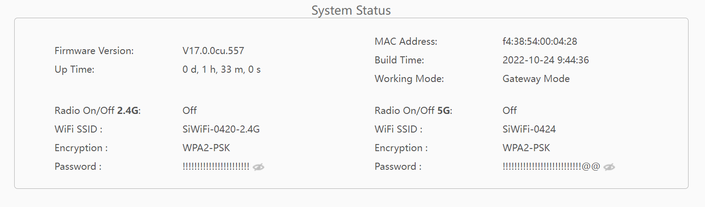

Visit /wizard.html directly

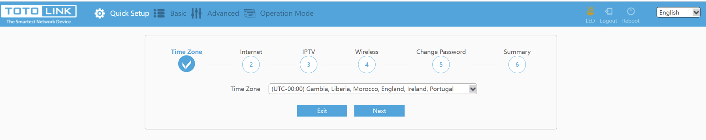

Reset the passwords & Submit

 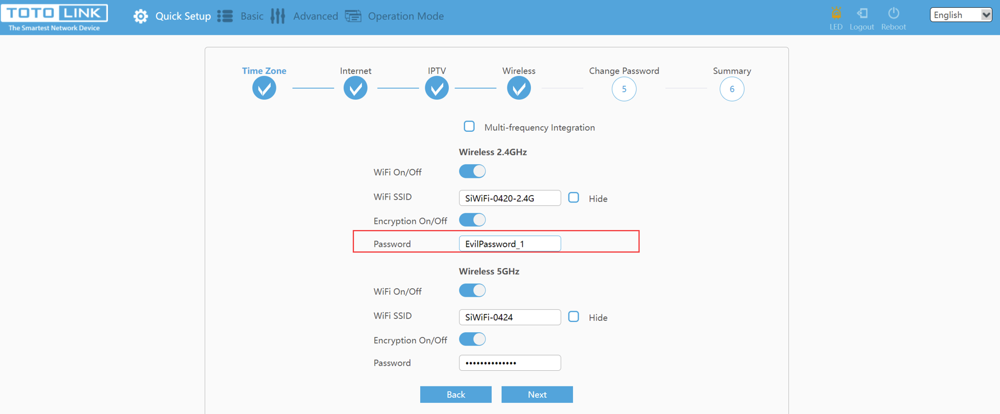

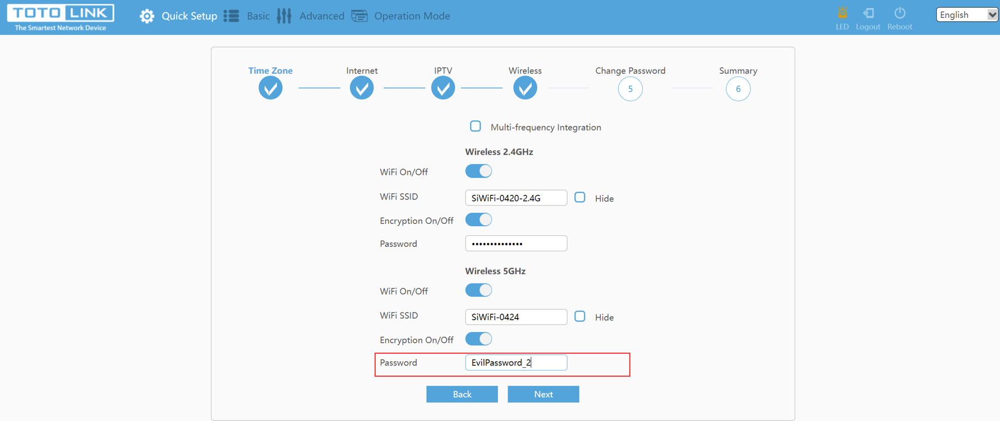

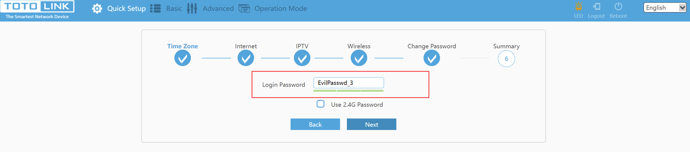

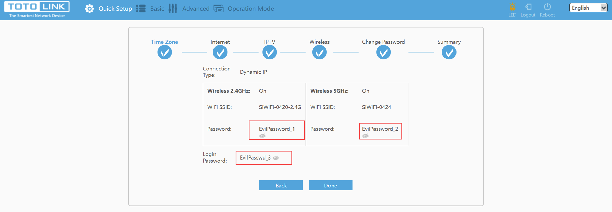

Check the result

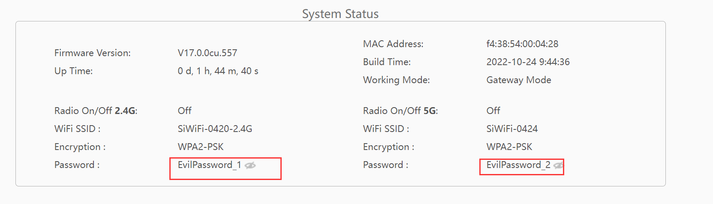

Login password can be changed at another page only if entering the right original one

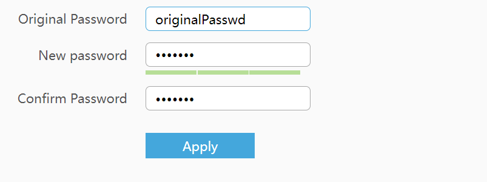

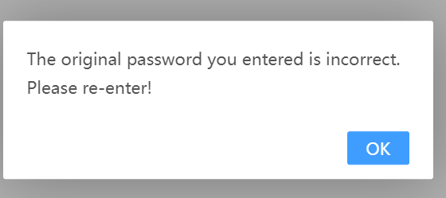

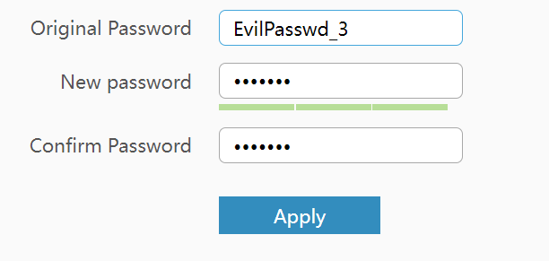

